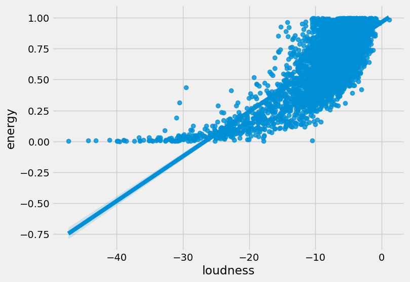
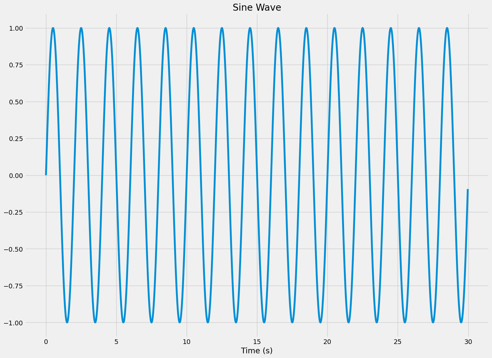
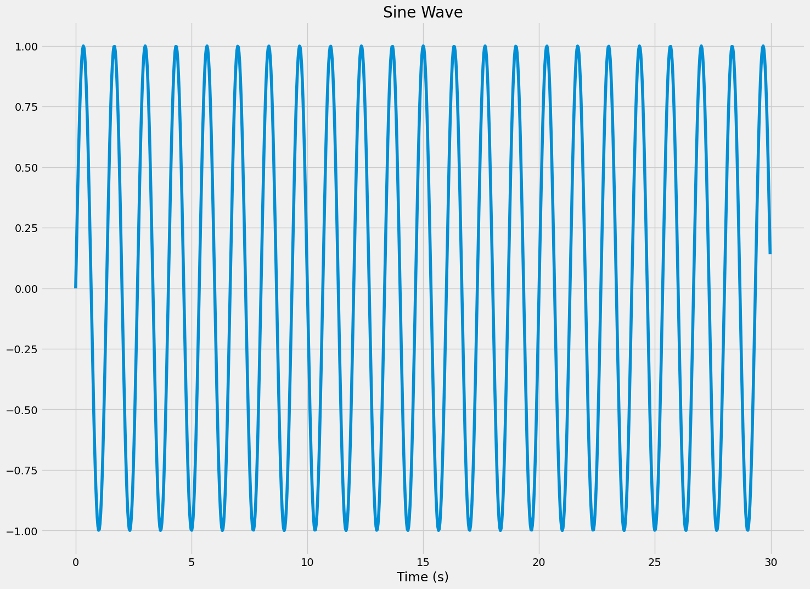
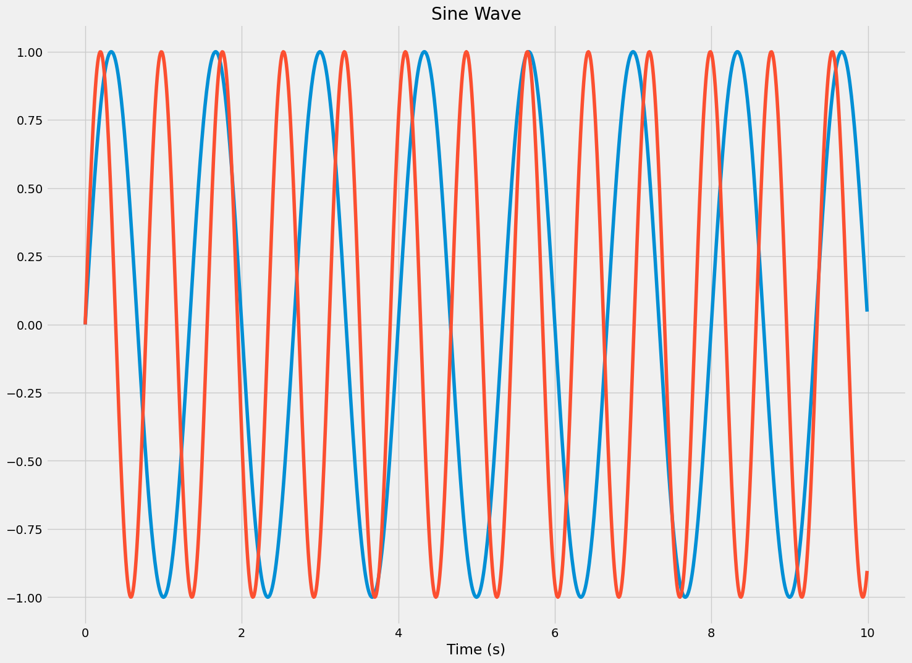
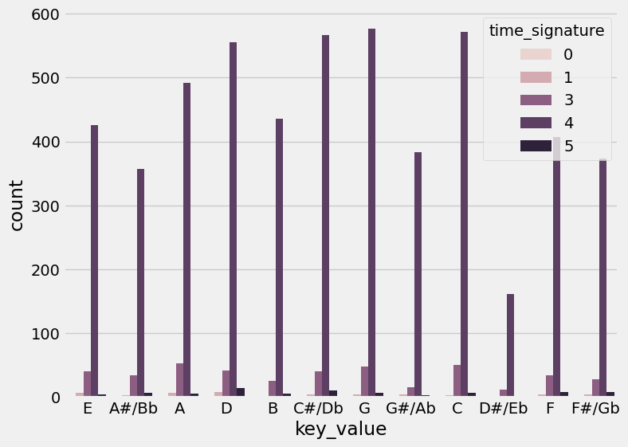

# async-red-aitannaparker-final-project
music mixing project

## Dataset
[dataset-of-00s.csv](https://www.kaggle.com/datasets/theoverman/the-spotify-hit-predictor-dataset?select=dataset-of-00s.csv)

## Why did I chose this dataset?
I wanted to show how to mix music based on tempo and key using the chamelot wheel. 

I want to mix music as some of my friends are djs and i want them to mix using music theory.
the circle of fifths or the wheel of chamelot will be the basis of mixing logic.

I want to take tempo, and key of a song and use that to spit out reccomend songs to mix with, or "similar songs". t
they can be of any genre but there needs to be a a relative key, parallel key of the song, and a tempo with at least
 x mod y = 8 for a bar overlap to get the correct tempo mix. 

## Progress
- [x] Picked dataset
- [x] Defined 10 questions
- [ ] Answered 10 questions using Pandas
- [ ] Added at least one data visualization (using Matplotlib and/or Seaborn) to each single question
- [ ] Prepared presentation slides to present at graduation

## Progress
- [ ] Question 0.0: What does the data set look like?
  - Answer: 
  
  We can see that there is a signigifant more number of songs in 4/4 than anything else. Good to know for the reccomendation system because it will effect how to meansure tempo. However, will not drop those values until at the at that stage. 

  this is how many songs per key we have in the data set
  - Visualization: 
  
  
  
  
  
reminder --> sections: The number of sections the particular track has. This feature was extracted from the data received by the API call for Audio Analysis of that particular track.

      high correlation:
sections has a high correlation with duration_ms, so yes more sections will lead to a long song. I will not explore this. 
      
      mid correlation:
      0.46 target and danceability
      0.35 target loudness
      0.28 target and valence
      

      0.59 valence and danceability

      no correlation:

      negative  mid correlation:
    -.47 target and instrumentalness have a mid negative correlation -.47
      
    target: The target variable for the track. It can be either '0' or '1'. '1' implies that this song has 
    featured in the weekly list (Issued by Billboards) of Hot-100 tracks in that decade at least once and is therefore a 'hit'. '0' Implies that the track is a 'flop'.

      negative high correlation:
      -.68 loudness and acousticness
      -.74 acousticness and energy

<!--  QUESTION 1  -->

- [ ] Question 1: What are the relationships between all of the variable?
  - Answer: Here we can see that the more energy a song has the more loud it is. This is helpful in understanding not to compare theses two together because it would sway as they are correlated. 
  - Visualization: 

<!--  QUESTION 2  -->

 [ ] Question 2: Since G is popular key, does it correlate with any other keys?

  - Answer: [Placeholder for answer]
  - Visualization: 

<!-- g_songs_tempo = songs_in_g_pivottb['G']

songs_like_g_song = songs_in_g_pivottb.corrwith(g_songs_tempo)
songs_like_g_song -->
output:
key_value
A       -1.000000
A#/Bb   -0.860447
B       -0.444204
C        0.245557
C#/Db    0.171978
D             NaN
D#/Eb         NaN
E        0.293840
F       -0.400993
F#/Gb    0.822570
G        1.000000
G#/Ab    0.976003
dtype: float64

<!--  QUESTION 3  -->
- [ ] Question 3: How can you demonstrate tempo in a song? Give an example

  - Answer:  you can represent tempo or bpm with a sine wave. When the curve cross the x axis, that is a beat. 
 

<!--  QUESTION 4 -->
- [ ] Question 4: WHat keys have more tempo?
  - Answer:  From the graph, you can see that G has the most songs.  
  D has the most time signatures in 5/4. A,C,E,G are very close in count for 3/4 signature.  
  - Visualization: 

<!--  QUESTION 5  -->
- [ ] Question 2: where are most of the artisit from?
  - Answer: [Placeholder for answer]
  - Visualization: 

<!--  QUESTION 6  -->

<!-- - [ ] Question 1: when to bring tracks up? (when tempo is within +-8 bpm of each other)
  - Answer: [Placeholder for answer]
  - Visualization:  -->

- [ ] Question 2: which song should be the main beat? ( the one with the higher bpm)
  - Answer: [Placeholder for answer]
  - Visualization: 

- [ ] Question 3:  When is tempo hiting in seconds (sing hertz*pi*)
    how long is a bar for the song?
  - Answer: [Placeholder for answer]
  - Visualization: 

- [ ] Question 4: How to transition to higher tempo? (which song can be sped up or down and by how much)
  - Answer: [Placeholder for answer]
  - Visualization: 

<!-- - [ ] Question 5: what genre of music is this song? ( based on bpm and speechiness)
  - Answer: [Placeholder for answer]
  - Visualization:  -->

<!-- - [ ] Question 7: what keys are most popular? tempos?
  - Answer: [Placeholder for answer]
  - Visualization:  -->

- [ ] Question 8: how many songs in the dataset could I mash up with this one ( based on key and tempo) ( need rec system)
  - Answer: [Placeholder for answer]
  - Visualization: 

- [ ] Question 9: what songs go with this in this key? give me a list? what songs go with this tempo? give me a list?
  - Answer: [Placeholder for answer]
  - Visualization: 

- [ ] Question 10: whats songs  match the vibe of this song (based on danceability and energy)?
  - Answer: [Placeholder for answer]
  - Visualization: 