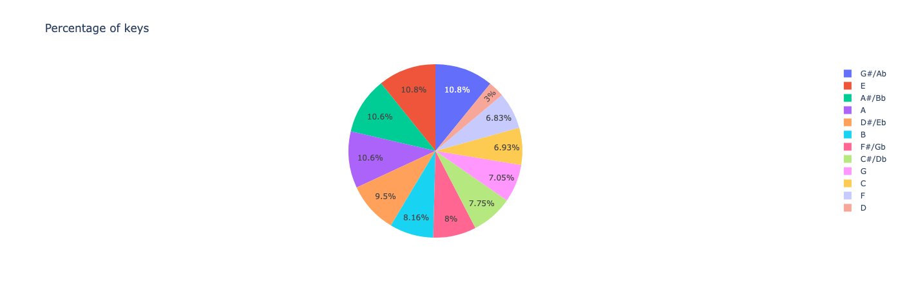

# async-red-aitannaparker-final-project
music mixing project

## Dataset
[dataset-of-00s.csv](https://www.kaggle.com/datasets/theoverman/the-spotify-hit-predictor-dataset?select=dataset-of-00s.csv)

## Why did I chose this dataset?
Since 2020, there has been an upkick in new Djs and they are not mixing music together correctly. From this observation, I learned about music theory and tempo mixing in order to mix and mash music. I wanted to create a recommendation system based on those variables. 

I used this dataset because it had keys and tempos labeled. It aslo had info on danceability, energy,, danceability, acousticness, instrumentalness, liveness, valence, chorus_hit, sections, loudness and some other factors that can contribute to the overall feel of a song. These are factors to be able to max. 
 

## Progress
- [x] Picked dataset
- [x] Defined 10 questions
- [x] Answered 10 questions using Pandas
- [x] Added at least one data visualization (using Matplotlib and/or Seaborn) to each single question
- [x] Prepared presentation slides to present at graduation

## Progress
- [ ] Question 1: How many time signatures in the dataset?
  - Answer: We can see that there is a signnifigant number of time 4/4 tempos in the dataset. This is important to note for mixing tempos as 3/4 and 4/4 are extremely hard to mix and mash. 
  - Visualization: (tempo_key_scale.png)

- [ ] Question 2: What is the make up of percentage of Keys?
  - Answer: Both G # ( G sharp) are and E make up 10..8% each as the largest keys in the dataset. 
  - Visualization: 

- [ ] Question 3: what keys are most keys and scales?
  - Answer: We can see here G has the scales and they are mostly major scales. B has more minor scales than majors. For 5 or the 12 scales, major has the most, but otherwise major and minor are evenly distributed. This adds new context to the dataset as major and minor scales mix very differently. So, although G# and E have similar counts, when account for the  scales, you can see that distribution looks very different. 
  - Visualization: )

- [ ] Question 4: What keys have more tempo based on scales?
  - Answer: We can see that G has the most 4/4 tempo and C# haas the most 3/4 timing. Accounting for keys, scales and tempo, we can see a better distribution of the dataset. 
  - Visualization: )

- [ ] Question 5: What is the tempo disctribution of the dataset?
  - Answer: The tempo distribution is a 2 peak bell-curve. Peaks at 96 bpm and 126 bpm. Meaning the most common tempos are at 96 and 126 bpm. 
  - Visualization: )

- [ ] Question 6: wWHat is the overall personality of the dataset?
  - Answer: I use the radar chart to prepresent the personality of the dataset. This incdlues relative variables that can be compared to each other as seen in the heat map: liveliness, instrumentalness, valence, acousticness, speechiness, and energy.
  - Visualization: )

     
 - [ ] Question 7:  When is tempo hitting in seconds 
    how long is a bar for the song?
  - Answer: Using the sin wave to represent tempo, I convert (sin hertz*pi*) from tempos 160 bpm and 96 bpm to see where they converge. They converge at 1.875 seconds. And for every 5 beats of teh 160bpm, they meet at beat 3 of the 96 bpm. This is helpful in tempo mixing and you wont have to wait too long for the rythms to match. I visualize this in the next question. 
  - Visualization: 

- [ ] Question 8: How would you compare compicated bpms?
  - Answer: With mixing 160 bpms, and 96 bpm, you can see that for every 5 beats the 3rd beat of the 96bpm will meet. Here is a representation of that below. You can use a scatter plot to represent the ratios, and then see where the beats align.
  - Visualization: !(compare_diff_beats.png)

- [ ] Question 9: If I pick 1 random song, how does it compare to the overall personaility of the daatset?
  - Answer: Here comparing based on those personaility variable, we can see wear G aligns and is uniqiue from the dataset. This random song in key G, has more danceability, valence and less energy. This visualization is helpful in understannd the song on a deeper level. This helps in being intentional with mixing music.  
  - Visualization: 

- [ ] Question 10: whatsvariables can compared?
  - Answer: 
  
  We can see that there is a signigifant more number of songs in 4/4 than anything else. Good to know for the reccomendation system because it will effect how to meansure tempo. However, will not drop those values until at the at that stage. 

  this is how many songs per key we have in the data set
  - Visualization: 
  
reminder --> sections: The number of sections the particular track has. This feature was extracted from the data received by the API call for Audio Analysis of that particular track.

      high correlation:
sections has a high correlation with duration_ms, so yes more sections will lead to a long song. I will not explore this. 
      
      mid correlation:
      0.46 target and danceability
      0.35 target loudness
      0.28 target and valence
      

      0.59 valence and danceability

      no correlation:

      negative  mid correlation:
    -.47 target and instrumentalness have a mid negative correlation -.47
      
    target: The target variable for the track. It can be either '0' or '1'. '1' implies that this song has 
    featured in the weekly list (Issued by Billboards) of Hot-100 tracks in that decade at least once and is therefore a 'hit'. '0' Implies that the track is a 'flop'.

      negative high correlation:
      -.68 loudness and acousticness
      -.74 acousticness and energy

 
